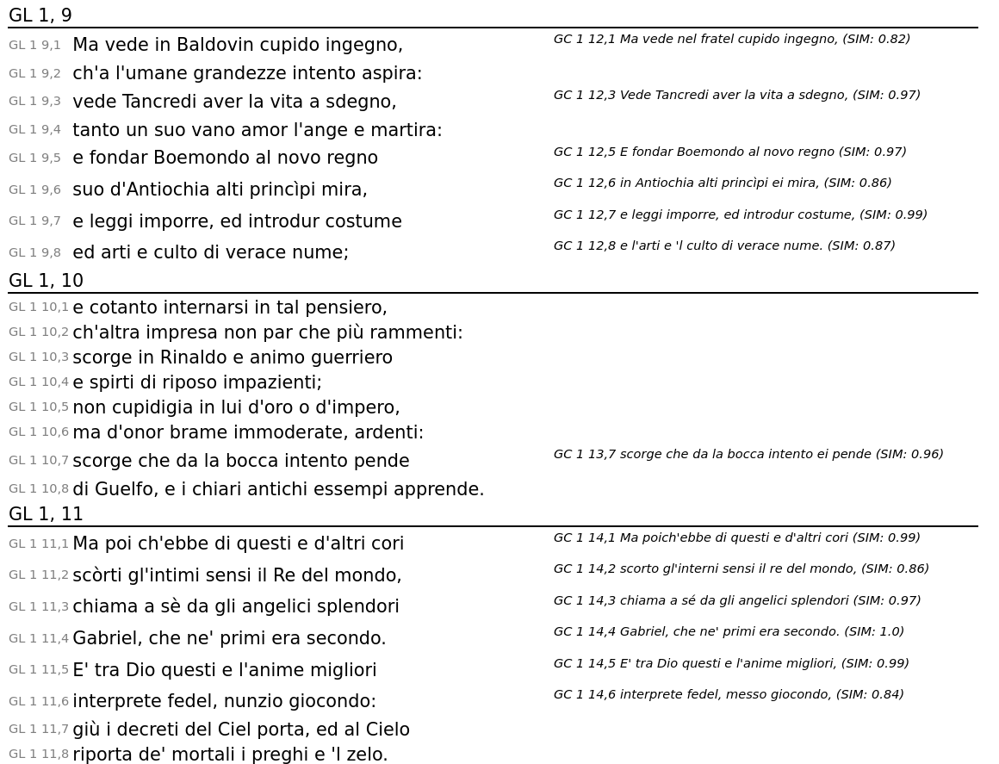

# Synopsis of Tasso's Gerusalemme Liberata and Conquistata

A simple script to align similar parts of the two versions of Tasso's famous chivalric poem on the First Crusade.

The alignment is done via a straightforward string similarity matching, no preprocessing.

The texts are taken from [Biblioteca italiana](www.bibliotecaitaliana.it). UNfortunately, the copyright statements there are not entirely clear, so no texts provided.

Instructions:

Clone the repo, start the Jupyter Notebook server (`jupyter-notebook`), open `liberata_conquistata.ipynb`, run it. Consider the potentially costly similarity ratio calcuations and just use the provided csv-file (`ratio_matrix.csv`). The results can be output in the html-format. In brackets you find the string similarity.

